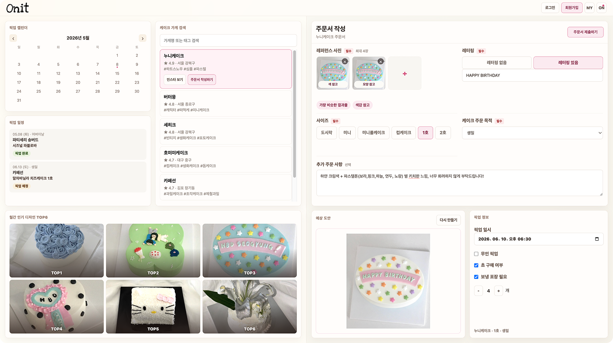

# O-nit

O-nit은 주문제작 케이크 주문 과정에서 사용자의 입력을 구조화된 주문 초안과 디자인 가이드 이미지로 변환하는 생성형 AI 과목용 프로토타입입니다.

현재 버전은 실시간 Gemini API나 ComfyUI API를 직접 호출하지 않고, 데모 JSON과 생성 이미지 파일을 기반으로 전체 흐름을 시연합니다.



## 목표

사용자는 레퍼런스 케이크 사진, 사진별 참고 태그, 간단한 주문 정보를 입력합니다. O-nit은 이 정보를 바탕으로 다음 결과를 만듭니다.

- 구조화된 주문 초안 JSON
- 레퍼런스 이미지 분석 요약
- 태그 기반 reference attention weight
- 가게별 스타일/제작 제약 RAG context
- ComfyUI SDXL + IPAdapter용 positive/negative prompt
- 케이크 디자인 mockup 이미지
- React 기반 static demo UI

## 입력 구조

사용자 입력은 다음 형태를 기준으로 합니다.

```json
{
  "shop_selection": {
    "shop_id": "nuni_cake",
    "shop_name": "누니케이크"
  },
  "user_input": {
    "lettering_text": "HBD!",
    "size_and_flavor": "1호 / 바닐라시트 + 우유생크림",
    "additional_requests": "연두색 키치한 느낌, 너무 화려하지 않게"
  },
  "reference_metadata": [
    {
      "image_id": "ref_001",
      "image_path": "data/images/raw/레터링:큐티2.jpeg",
      "is_store_reference": false,
      "is_closest_reference": true,
      "reference_role": "closest_result",
      "selected_tags": ["closest_result", "color_reference"]
    }
  ]
}
```

## 파이프라인

1. 사용자가 레퍼런스 이미지, 태그 metadata, 주문 입력값을 입력합니다.
2. `reference_metadata.selected_tags`를 바탕으로 reference attention weight를 계산합니다.
3. 선택한 가게 정보를 기준으로 로컬 RAG profile에서 스타일, 가능 옵션, 제작 제약을 검색합니다.
4. fallback mock이 입력값, attention, RAG context를 바탕으로 `order_draft`를 생성합니다.
5. LangGraph로 확장 가능한 workflow trace를 노드 단위로 기록합니다.
6. Prompt Builder가 `order_draft`를 ComfyUI용 positive/negative prompt로 변환합니다.
7. ComfyUI + IPAdapter workflow template을 기준으로 디자인 mockup 생성 흐름을 시연합니다.
8. React UI가 입력, 주문서, 예상 도안, 픽업 정보를 static demo로 보여줍니다.

자세한 설명은 [docs/pipeline.md](docs/pipeline.md)를 참고합니다.

## 폴더 구조

```text
.
├── data/
│   ├── demo_orders/      # 데모 입력/주문 JSON
│   ├── generated/        # ComfyUI 생성 결과 이미지
│   ├── images/           # 원본 레퍼런스 이미지
│   ├── labels/           # 라벨 스키마
│   └── rag/              # 가게별 RAG mock 데이터
├── comfyui_workflows/    # SDXL + IPAdapter workflow template
├── docs/                 # 프로젝트 문서와 README용 이미지
├── frontend/             # React static demo UI
└── scripts/              # Python 파이프라인 스크립트
```

## 주요 파일

- [data/demo_orders/demo_001_input.json](data/demo_orders/demo_001_input.json): 데모 입력 데이터
- [data/demo_orders/demo_001.json](data/demo_orders/demo_001.json): attention, RAG, workflow trace, prompt가 포함된 데모 출력
- [data/rag/shop_profiles.json](data/rag/shop_profiles.json): 가게별 스타일/제약 RAG mock 데이터
- [scripts/run_onit_workflow.py](scripts/run_onit_workflow.py): LangGraph-style local workflow 실행 스크립트
- [scripts/build_comfyui_prompt.py](scripts/build_comfyui_prompt.py): ComfyUI용 prompt 생성 스크립트
- [comfyui_workflows/sdxl_ipadapter_cake_mockup_template.json](comfyui_workflows/sdxl_ipadapter_cake_mockup_template.json): SDXL + IPAdapter workflow template
- [frontend/src/main.jsx](frontend/src/main.jsx): React demo UI

## 실행 방법

주문 초안과 workflow trace를 다시 생성합니다.

```bash
python scripts/run_onit_workflow.py --input data/demo_orders/demo_001_input.json --output data/demo_orders/demo_001.json
```

ComfyUI용 prompt를 다시 생성합니다.

```bash
python scripts/build_comfyui_prompt.py --input data/demo_orders/demo_001.json
```

React demo UI를 실행합니다.

```bash
cd frontend
npm install
npm run dev
```

## 구현 범위

구현된 항목:

- 데모 입력 JSON과 주문 초안 JSON
- 태그 기반 reference attention mock
- 가게별 RAG profile mock
- LangGraph-style workflow trace
- ComfyUI positive/negative prompt builder
- SDXL + IPAdapter workflow template
- React static demo UI

아직 구현하지 않은 항목:

- 실시간 Gemini API 호출
- 실시간 ComfyUI API 호출
- 실제 이미지 업로드 서버
- 실제 주문, 결제, 제작 연동

## 기술 스택

- Python
- React
- Gemini 설계 mock
- ComfyUI
- SDXL
- IPAdapter
- RAG mock
- LangGraph-style workflow mock
